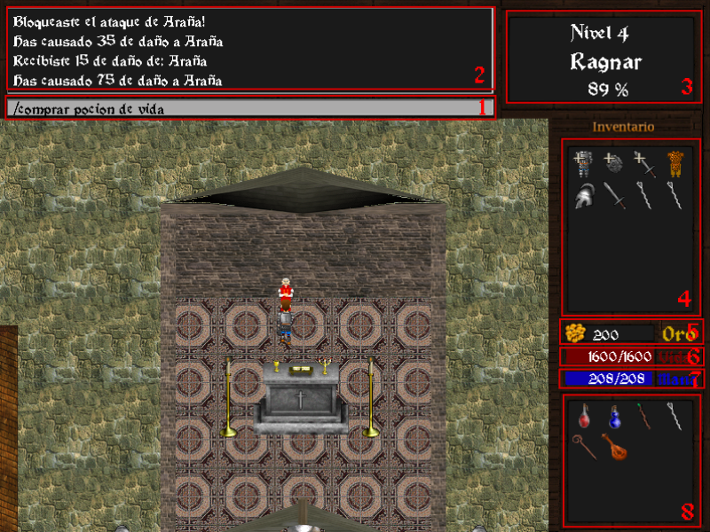
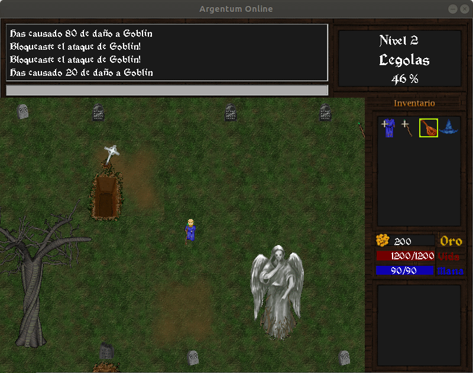
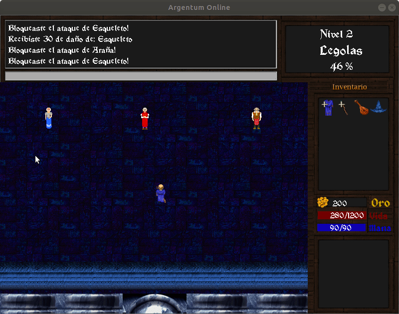
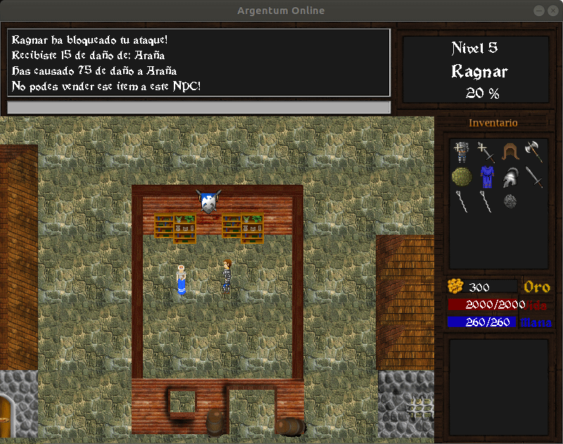
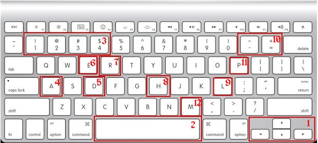

# Argentum Online (remake)

## Introducción

Remake del **Argentum Online**, el primer **MMORPG** argentino creado a finales de los 90' con Visual Basic. Este remake hecho con C++, intenta conservar tanto la vista área 2D y los gráficos del juego original para ser fiel a su estilo. 
Desarrollado en 6 semanas por tres estudiantes de Facultad de Ingeniería de la Universidad de Buenos Aires, a modo de trabajo práctico final para la materia Taller de Programación (75.42).

Documentación adicional:

## Dependencias
Dentro del instalador del juego estás dependencias serán provistas en caso de que el usuario lo desee.

Sistema Operativo: Ubuntu 18.04

|Librería | Versión mínima|
--------|---------------------------
|libsdl2-dev | 2.0.8 |
| libsdl2-image-dev | 2.0.3 |
| libsdl2-ttf-dev | 2.0.14  |
| libsdl2-mixer-dev | 2.0.2 |
| cmake | 3.10.2 |
| gcc | 7.3.0 |

## Para instalar el juego:

### Con instaladores:
 
  - Para levantar el server pararse en root y ejecutar el bash `start_server.sh`

  - Para levantar el client pararse en root y ejecutar el bash `start_client.sh` 

### Manualmente:

  1. Crear una carpeta llamada *build* para instalar los binarios del juego. Para el ejemplo, vamos a crear a build dentro del directorio del programa.

  1. Desde una terminar situada en build ejecutar: 
`cmake .. && make && make install` 

  1. Una vez installados los archivos, desde una terminal situarse en `build/server` y para levantar el server ejecutamos:
`./server <puerto> entities.json` 

  1. Una vez levantado el server, nos situaremos en `build/client` y para correr el juego ejecutaremos:
`./client <ip> <puerto>` 
En caso de haber levantado el server de forma local la ip será 
`localhost` 

### Para levantar el server con Docker:
`docker build -t "server:1.0.0" -f server.Dockerfile .` 
`docker run --net=host <id imagen>` 
Luego levantar el cliente en localhost con el puerto 8080

## Manual del juego

### Objetivo

El objetivo de este juego de rol es crearse un personaje de fantasia para interactuar en un mundo abierto con otros personajes y *monstruos*.
Parte de la temática de este tipo de juegos, es que no hay un objetivo definido en concreto, sino   más bien diversas maneras de jugarlo.

### Lobby

Al iniciar el cliente se nos cargará el lobby del juego. Dandonos a elegir la resolución con la que queremos jugar (por default se ejecutará en *800x600*) y un nombre de usuario (obligatorio) para persistir el usuario.
Además del usuario  se encuentra un ingreso de contraseña que no es relevante su ingreso ya que aun no fue implementada la lógica del lado del server.

Luego de ingresar nuestro usuario y elegir una resolución el juego nos pedirá seleccionar una raza y una clase para nuestro personaje ofreciendonos además una descripción de ambos en la parte inferior. Además de raza y clase también podremos elegir el mapa en el cual empezar. Por default las opciones elegidas son: **Humano**, **Guerrero** y **Bosque desolado**. Se permité un solo personaje por usuario y, en caso de ya haber creado previamente un personaje con dicho nombre de usuario, al jugar continuaremos con el personaje previamente creado.

### Juego

#### Introducción a la UI

1. **Chat:** El chat de juego es usado para ingresar los comandos disponibles para interactuar con los NPC y también para enviar mensajes privados a otros jugadores.

1. **Mensajes del mini-chat:** Muestra los últimos 4 mensajes del mini chat. Se suelen ver mensajes descriptivos de los combates (daño infligido, daño recibido, evasión, etc.) y los mensajes privados que nos envian otros jugadores.

1. **Información general:** En este recuadro podemos ver la información básica de nuestro usuario/personaje. De arriba hacia abajo: el nivel actual de nuestro personaje, su nombre y en que porcentaje del nivel se encuentra (cuando llega al 100% pasa al siguiente nivel).

1. **Inventario:** En el inventario podemos visualizar nuestras pertenencias. Cuando un objeto tiene un **+** blanco encima significa que lo tenemos equipado.

1. **Oro:** El oro disponible que tenemos, nos servirá a la hora de comerciar. Podemos llevar con nosotros más o menos oro dependiendo de nuestro nivel.

1. **Oro:** El oro disponible que tenemos, nos servirá a la hora de comerciar.

1. **Vida:** Los puntos de vida actuales de nuestro personaje, cuando los puntos llegan a 0 el personaje muere.

1. **Maná:** Los puntos de maná actuales de nuestro personaje. Estos puntos sirven para poder usar los distintos hechizos mágicos.

1. **Mercado/Banco:** En esta sección visualizaremos el mercado si estamos intentando *comprar/vender* con un comperciante o bien el banco si estamos tratando de *depositar/retirar* algun objeto con el banquero.

### Comandos

En esta sección se listaran los comandos admitidos en la barra de chat y cuando se pueden usar.

- **/meditar** : Se puede usar en cualquier momento y su función es que el personaje empiece a recuperar maná rápidamente.

- **/revivir** : Cuando los puntos de vida del jugador llegan a cero entra en modo fantasma, para revivir el jugador deberá ingresar el comando y esperar unos segundos o bien, situarse al lado del sacerdote y revivir de inmediato al ingresar el comando.

- **/curar** : El mensaje deberá ser ingresado junto a un sacerdote y el jugador recuperará puntos de vida y puntos de maná.

- **/listar** : El mensaje deberá ser ingresado junto a un comerciante o un banquero y se mostrará el mercado disponible o los items guardados en el banco según sea la situación.

- **/depositar <objeto>** : Una vez se haya ingresado el comando **/listar** junto a un banquero, el deposito del banco se abrirá. Con el deposito abierto el jugador podrá depositar items en el banco con el comando o bien haciendo click en los items de su inventario para depositarlos.

- **/retirar <objeto>** : Al igual que **/depositar**, primero hay que usar **/listar** para abrir la bóveda del banco y luego con el comando se podrá retirar los items deseados. Para retirar items del banco también se puede hacer click en los items que se muestran en el banco.

- **/vender <objeto>** : Para usar este comando primero hay que abrir el mercado usando el comando **/listar** junto a un comerciante. Una vez abierto el mercado se podrá vender objetos con el comando o bien haciendo click en el inventario sobre el item que se quiere vender.

- **/comprar <objeto>** : Al igual que antes primero se debe abrir el mercado. Una vez abierto, se podrá comprar objetos con el comando o bien haciendo click en el mercado sobre el item que se quiere comprar.

- **/tirar** : Una vez seleccionado el item que se desea tirar (haciendo click sobre el y que tenga el recuadro amarillo de selección) usamos el comando para dejar el item en el suelo.

- **/tomar** : Para usar este comando hay que posicionarse sobre el item que se quiere recojer.

### Teclado

Además de los comandos del chat muchas acciones se pueden suplir por teclas del teclado

1. **Flechas** : Sirven para mover y direccionar al jugador en la dirección deseada.

2. **Barra espaciadora** : Se usa para atacar con el arma equipada, en caso de no tener ningún arma se atacará con los puños. Paras atacar al objetivo se debe estar alineado con el, y estar al rango correcto para atinarle. 

3. **Teclas numericas** : Se utilizan para viajar entre los distintos mundos disponibles, actualmente hay 4.

4. **A** : Si el personaje se posiciona arriba de un item que esta en el suelo, con la tecla *A* podrá tomarlo.

5. **D** : Si tenemos un item previamente seleccionado y que no este equipado, con la tecla *D* podremos tirarlo al suelo.

6. **E** : Si no estamos en medio de un combate con la tecla *E* podremos comenzar a meditar para recuperar puntos de maná.

7. **R** : Sirve para revivir. Si el personaje se encuentra junto con un sacerdote revive de
inmediato. Sino debe esperar según cuan lejos se esté del sacerdote, o cambiar de mapa si no hay un sacerdote en el que se encuentra.

8. **H** : Con esta tecla si estamos junto a un sacerdote podremos usar el comando **/curar** recuperando puntos de vida y maná.

9. **L**: Sube automáticamente de nivel.

10. **- / +** : Para controlar el volumen de la música de fondo.

11. **P**: Sirve tanto como para pausar o reanudar la música de fondo del juego.

12. **M**: Para la música del juego.
